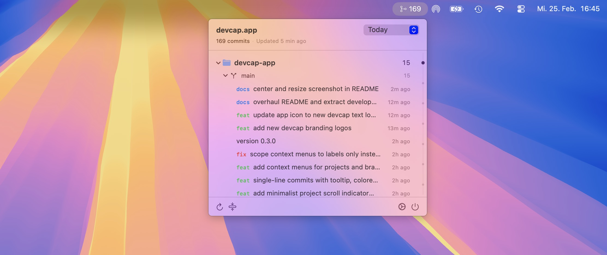

<p align="center">
  <picture>
    <source media="(prefers-color-scheme: dark)" srcset="docs/images/devcap-app-logo-dark.svg">
    
  </picture>
</p>

<p align="center">
  Native macOS menubar app for <a href="https://github.com/konradmichalik/devcap">devcap</a> — shows your daily git commits at a glance without leaving the keyboard.
</p>

Scans a directory tree for git repos in parallel via the same Rust core, and renders a collapsible `Project > Branch > Commits` tree directly in your menubar.

<p align="center">
  
</p>

## ✨ Features

- **Menubar-native** — lives in the system menubar, no Dock icon
- **Collapsible tree** — drill down through projects, branches, and commits
- **Conventional commit highlighting** — color-coded type tags (`feat`, `fix`, `refactor`, ...)
- **Flexible time periods** — Today, Yesterday, This Week, Last 7 Days
- **Auto-refresh** — configurable interval (5 / 15 / 30 minutes)
- **Copy commit hash** — right-click any commit to copy its hash to the clipboard
- **Parallel scanning** — powered by [rayon](https://github.com/rayon-rs/rayon) via devcap-core

> [!NOTE]
> Requires `git` on `$PATH`. Author defaults to `git config --global user.name`.

## 🔥 Installation

### Homebrew (macOS)

```bash
brew install --cask konradmichalik/tap/devcap-app
```

To update to the latest version:

```bash
brew upgrade --cask konradmichalik/tap/devcap-app
```

### Download

Grab the latest `.dmg` from [Releases](https://github.com/konradmichalik/devcap-app/releases), open it, and drag the app to Applications.

> [!TIP]
> Want to build from source? See [docs/DEVELOPMENT.md](docs/DEVELOPMENT.md).

## 📜 License

MIT
